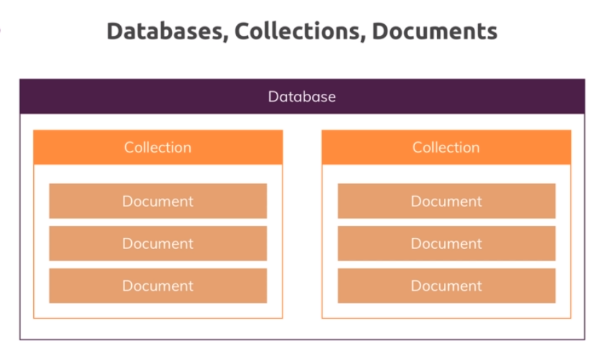
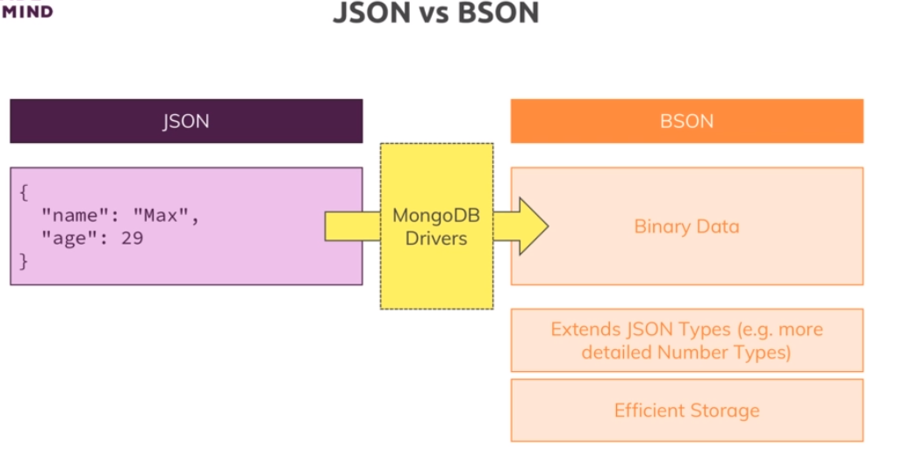
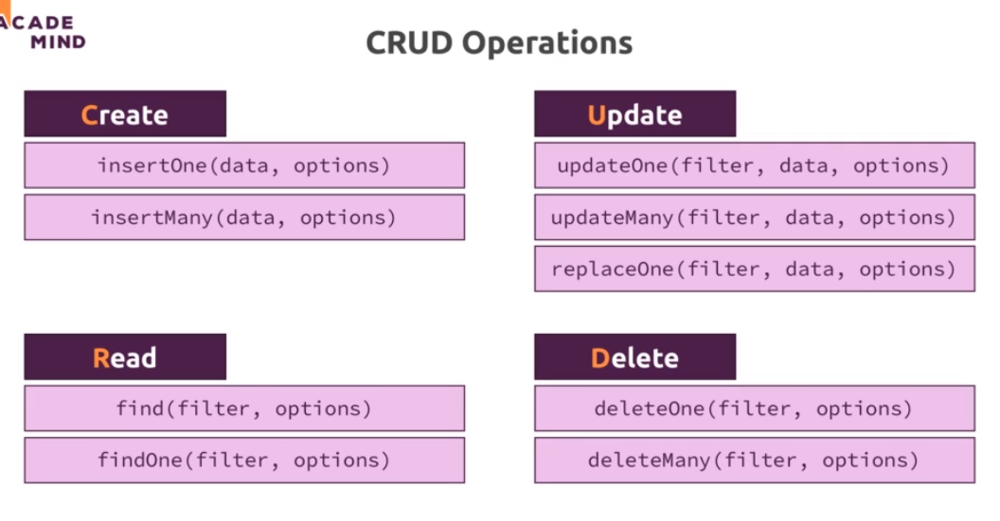

# 2-Basics-CRUD
1. [Databases,Collections and Documents](#schema1)
2. [The Shell & MongoDB Drivers](#schema2)
3. [Creating Databases & Collections](#schema3)
4. [Understanding JSON Data](#schema4)
5. [Comparating JSON & BSON](#schema5)
6. [CRUD & MongoDB](#schema6)
7. [Understanding "insertMany()"](#schema7)
8. [Understanding "find()"](#schema8)
9. [update vs updateMany()](#schema9)

<hr>

<a name="schema1"></a>

## 1. Databases,Collections and Documents



**Base de Datos:**

En MongoDB, una base de datos es el contenedor de alto nivel que almacena conjuntos de colecciones. 
Cada base de datos tiene un nombre único.
Las bases de datos no requieren una estructura predefinida y pueden contener múltiples colecciones.
Ejemplo de creación de una nueva base de datos en MongoDB:

**Colección:**

Una colección es un conjunto de documentos en MongoDB. Es análogo a una tabla en bases de datos relacionales.
Las colecciones no tienen un esquema fijo y pueden contener documentos con campos diferentes.
Las colecciones pueden ser creadas automáticamente cuando se insertan documentos en ellas.
Ejemplo de creación de una nueva colección en MongoDB (se crea automáticamente al insertar el primer documento):


**Documento:**

Un documento es una unidad básica de datos en MongoDB. Es un conjunto de pares clave-valor.
Los documentos en una colección pueden tener campos diferentes, lo que significa que cada 
documento puede tener una estructura única.
Los documentos se almacenan en formato BSON (Binary JSON), que es una representación binaria de JSON.


En MongoDB, las colecciones son flexibles en cuanto a la estructura de los documentos que pueden almacenar. 
A diferencia de las tablas en las bases de datos relacionales, donde cada fila debe seguir el mismo esquema, 
en MongoDB, los documentos dentro de una colección pueden tener estructuras diferentes. Esto se conoce como un 
modelo de datos flexible o un esquema dinámico.

En una misma colección, puedes tener documentos con campos diferentes y estructuras variadas. 
Esto significa que un documento puede contener un conjunto específico de campos, mientras que otro documento 
puede tener campos adicionales o diferentes.

<hr>

<a name="schema2"></a>


## 2. The Shell & MongoDB Drivers

- CRUD

https://www.mongodb.com/docs/mongodb-shell/crud/

<hr>

<a name="schema3"></a>

## 3. Creating Databases & Collections

- use base_de_datos
```
test> use flights
switched to db flights
```
Cuando usamos este comando se selecciona la base de datos, pero si la base de datos no existe se creará. 
Hay que tener en cuenta que la base de datos no se creará físicamente en el disco hasta que se 
inserte el primer documento o se realice alguna otra operación en esa base de datos.

- Creando colleción
```
flights> db.flightData.insertOne({})
```

En este caso al haber usado la primera sentecina `use BBDD`, ya estamos en la base de datos que queremos, ahora entrará
en la colección correspondiente si existe, sino existe la crea y además inserta los datos.


<hr>

<a name="schema4"></a>

## 4. Understanding JSON Data

```
[
  {
    "departureAirport": "MUC",
    "arrivalAirport": "SFO",
    "aircraft": "Airbus A380",
    "distance": 12000,
    "intercontinental": true
  },
  {
    "departureAirport": "LHR",
    "arrivalAirport": "TXL",
    "aircraft": "Airbus A320",
    "distance": 950,
    "intercontinental": false
  }
]

```
- Insertar en la colección
```
flights> db.flightData.insertOne({
...     "departureAirport": "MUC",
...     "arrivalAirport": "SFO",
...     "aircraft": "Airbus A380",
...     "distance": 12000,
...     "intercontinental": true
...   })
{
  acknowledged: true,
  insertedId: ObjectId('655f66c6a053c6f344e7bb60')
}

```
- Ver lo que hay dentro de la coleccion
```
flights> db.flightData.find()
[
  {
    _id: ObjectId('655f66c6a053c6f344e7bb60'),
    departureAirport: 'MUC',
    arrivalAirport: 'SFO',
    aircraft: 'Airbus A380',
    distance: 12000,
    intercontinental: true
  },
  {
    _id: ObjectId('655f675ca053c6f344e7bb61'),
    departureAirport: 'LHR',
    arrivalAirport: 'TXL',
    aircraft: 'Airbus A320',
    distance: 950,
    intercontinental: false
  }
]

```
<hr>

<a name="schema5"></a>


## 5. Comparating JSON & BSON



En el caso específico de MongoDB, el formato de almacenamiento predeterminado es BSON (Binary JSON). 
MongoDB utiliza BSON para representar documentos almacenados en sus colecciones. Aunque la interfaz de consulta 
y manipulación de datos en MongoDB se asemeja a trabajar con documentos JSON, internamente, los datos se almacenan 
en formato BSON.

Aquí hay algunas razones por las que MongoDB utiliza BSON:

- Eficiencia de Almacenamiento y Transmisión: BSON es un formato binario que resulta más eficiente en términos de 
almacenamiento y ancho de banda en comparación con JSON. Esto es beneficioso para la eficiencia de MongoDB, 
- especialmente cuando se trata de grandes cantidades de datos.

- Tipos de Datos Adicionales: BSON extiende el conjunto de tipos de datos que se pueden representar 
en comparación con JSON estándar. MongoDB utiliza estos tipos de datos adicionales para almacenar información 
específica, como fechas y datos binarios, de una manera más eficiente que si se codificaran directamente en JSON.

- Desempeño en Operaciones de Búsqueda y Indexación: La estructura binaria de BSON permite realizar 
operaciones de búsqueda y indexación más eficientes en comparación con JSON. Esto es fundamental 
para el rendimiento de las consultas en MongoDB, especialmente en entornos donde la velocidad de acceso 
a los datos es crítica.

En resumen, MongoDB utiliza BSON como su formato de almacenamiento interno para aprovechar las ventajas 
de eficiencia y funcionalidad adicional que ofrece en comparación con JSON estándar. Aunque la interfaz 
de MongoDB se presenta de manera similar a JSON, la elección de BSON subyacente contribuye a la eficiencia 
y el rendimiento general del sistema.


<hr>

<a name="schema6"></a>


## 6. CRUD & MongoDB



- Delete 
**One**
```
flights> db.flightData.deleteOne({departureAirport: 'LHR'})
{ acknowledged: true, deletedCount: 1 }
```
```
flights> db.flightData.find()
[
  {
    _id: ObjectId('655f66c6a053c6f344e7bb60'),
    departureAirport: 'MUC',
    arrivalAirport: 'SFO',
    aircraft: 'Airbus A380',
    distance: 12000,
    intercontinental: true
  }
]

```
**Many**
```
flights> db.flightData.deleteMany({marker: 'toDelete'})
{ acknowledged: true, deletedCount: 2 }
flights> db.flightData.find()
```
- Update
```
db.collection.updateOne(
   { <criterios de consulta> },
   { $set: { <nuevos valores> } }
)
```
Es importante destacar que updateOne actualiza solo el primer documento que cumple con los criterios de consulta. 
Si deseas actualizar todos los documentos que coinciden con los criterios, puedes usar updateMany en su lugar.

En el caso que en los `criterios de consulta` esté vacío se añade los nuevos valores a todos los documento de la 
colección

```
flights> db.flightData.updateOne({distance:12000}, {$set:{marker:"delete"}})
{
  acknowledged: true,
  insertedId: null,
  matchedCount: 1,
  modifiedCount: 1,
  upsertedCount: 0
}
```

```
flights> db.flightData.find()
[
  {
    _id: ObjectId('655f66c6a053c6f344e7bb60'),
    departureAirport: 'MUC',
    arrivalAirport: 'SFO',
    aircraft: 'Airbus A380',
    distance: 12000,
    intercontinental: true,
    marker: 'delete'
  }
]
flights> 
```

<hr>

<a name="schema7"></a>


## 7. Understanding "insertMany()"

Se puede insertar varios elementos como un array de diccionarios.

```
flights> db.flightData.insertMany([
...   {
...     "departureAirport": "MUC",
...     "arrivalAirport": "SFO",
...     "aircraft": "Airbus A380",
...     "distance": 12000,
...     "intercontinental": true
...   },
...   {
...     "departureAirport": "LHR",
...     "arrivalAirport": "TXL",
...     "aircraft": "Airbus A320",
...     "distance": 950,
...     "intercontinental": false
...   }
... ])
{
  acknowledged: true,
  insertedIds: {
    '0': ObjectId('655f7a3747ec27bf9294c783'),
    '1': ObjectId('655f7a3747ec27bf9294c784')
  }
}
```
Se puede comprobar que los `ObjectId` son correlativos
```
flights> db.flightData.find()
[
  {
    _id: ObjectId('655f7a3747ec27bf9294c783'),
    departureAirport: 'MUC',
    arrivalAirport: 'SFO',
    aircraft: 'Airbus A380',
    distance: 12000,
    intercontinental: true
  },
  {
    _id: ObjectId('655f7a3747ec27bf9294c784'),
    departureAirport: 'LHR',
    arrivalAirport: 'TXL',
    aircraft: 'Airbus A320',
    distance: 950,
    intercontinental: false
  }
]
flights> 


```
<hr>

<a name="schema8"></a>


## 8. Understanding "find()"

A la sentecia `find()` le podemos poner un diccionario con lo que queremos buscar.

```
flights> db.flightData.find({aircraft:'Airbus A380'})
[
  {
    _id: ObjectId('655f7a3747ec27bf9294c783'),
    departureAirport: 'MUC',
    arrivalAirport: 'SFO',
    aircraft: 'Airbus A380',
    distance: 12000,
    intercontinental: true
  }
]

```
Al poner le dentro del find un diccionario con el $ podemos hacer búsquedas para valores mayores que, con esta 
sentencia `{distance:{$gt:10000}}`
```
flights> db.flightData.find({distance:{$gt:10000}})
[
  {
    _id: ObjectId('655f7a3747ec27bf9294c783'),
    departureAirport: 'MUC',
    arrivalAirport: 'SFO',
    aircraft: 'Airbus A380',
    distance: 12000,
    intercontinental: true
  }
]
```
Algunos de los operadores más comunes incluyen:

**Operadores de Comparación:**

- $eq: Igual a
- $ne: No igual a
- $lt: Menor que
- $lte: Menor o igual a
- $gt: Mayor que
- $gte: Mayor o igual a

**Operadores Lógicos:**

- $and: Cumple con todos los criterios
- $or: Cumple con al menos uno de los criterios
- $not: No cumple con el criterio especificado
- $nor: No cumple con ninguno de los criterios

**Otros Operadores:**

- $in: Coincide con alguno de los valores especificados en un array
- $nin: No coincide con ninguno de los valores especificados en un array
- $exists: Coincide con documentos que contienen o no contienen un campo específico


- Cursor Object
Cuando ejecutas find(), MongoDB devuelve un cursor. Un cursor es un puntero a los resultados de la consulta que 
puedes iterar para acceder a los documentos recuperados.

Algunas de las acciones comunes que puedes realizar son las siguientes:

**Métodos de Filtrado:**
- .sort(): Ordena los resultados en función de un campo dado.
- .limit(): Limita el número de documentos devueltos.
- .skip(): Omite un número específico de documentos al inicio.
- .projection(): Proyecta (selecciona) campos específicos para devolver.


**Métodos de Iteración:**
- .forEach(): Itera sobre los documentos y ejecuta una función para cada uno.
- .toArray(): Convierte los resultados en un array.

**Métodos de Conteo y Estadísticas:**
- .countDocuments(): Devuelve el número de documentos que coinciden con la consulta.
- .explain(): Proporciona estadísticas sobre el rendimiento de la consulta.

**Operaciones de Agregación:**
- .aggregate(): Permite realizar operaciones de agregación más complejas utilizando el framework de agregación de MongoDB.


- Ejemplo:
```
flights> const resultadoAgregacion = db.passengers.aggregate([ { $group: { _id: null, edadPromedio: { $avg: "$age" } } }] ).toArray()

flights> db.passengers.insertOne({resultadoAgregacion})
{
  acknowledged: true,
  insertedId: ObjectId('656077b1908c91a7cd6a8ad9')
}
```


<hr>

<a name="schema9"></a>


## 9. update vs updateMany()

- updateOne()
Para actualizar un documento siempre hay que poner el operador atómico `$set`

```
flights> db.flightData.updateOne({_id:ObjectId('655f7a3747ec27bf9294c783')}, {$set:{dealyed:true}})
{
  acknowledged: true,
  insertedId: null,
  matchedCount: 1,
  modifiedCount: 1,
  upsertedCount: 0
}
```

- updateMany()


```
flights> db.flightData.updateMany ({distance:{$gt :900}}, {$set:{dealyed:false}})
{
  acknowledged: true,
  insertedId: null,
  matchedCount: 2,
  modifiedCount: 1,
  upsertedCount: 0
}
flights> db.flightData.find()
[
  {
    _id: ObjectId('655f7a3747ec27bf9294c783'),
    departureAirport: 'MUC',
    arrivalAirport: 'SFO',
    aircraft: 'Airbus A380',
    distance: 12000,
    intercontinental: true,
    dealyed: false
  },
  {
    _id: ObjectId('655f7a3747ec27bf9294c784'),
    departureAirport: 'LHR',
    arrivalAirport: 'TXL',
    aircraft: 'Airbus A320',
    distance: 950,
    intercontinental: false,
    dealyed: false
  }
]

```


